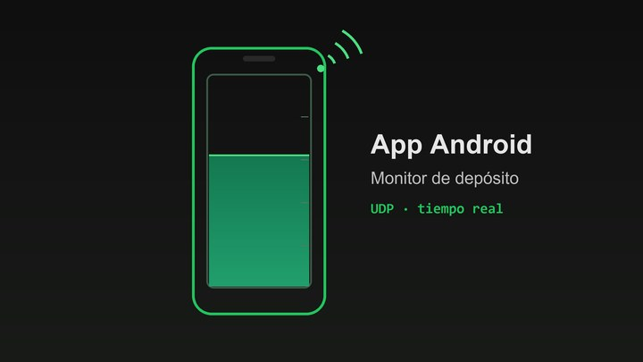

# App Android — Monitor de depósito

Aplicación Android nativa que monitoriza en tiempo real un depósito de agua, comunicándose por UDP con un servidor de telemetría.

## Qué hace

- Pide el estado al servidor de forma periódica y muestra el nivel del depósito, el estado de la boya y de los grifos.
- Enseña también el JSON recibido, para depurar la comunicación.
- La dirección y el puerto del servidor se configuran en la propia pantalla.

## Cómo ejecutarlo

Abre la carpeta en Android Studio y ejecuta la app en un emulador o en un móvil con Android 7.0 o superior.

## Contenido

| Fichero | Qué es |
|---|---|
| `app/src/main/java/.../MainActivity.java` | Pantalla principal |
| `app/src/main/java/.../Telemetria.java` | Comunicación UDP con el servidor |
| `app/src/main/res/layout/activity_main.xml` | Interfaz |

> El servidor de telemetría no está incluido en este repo.

---

Proyecto del Grado en Tecnología Digital y Multimedia (UPV). Forma parte de mi [portfolio](https://quique-such.github.io/portafolio/).
